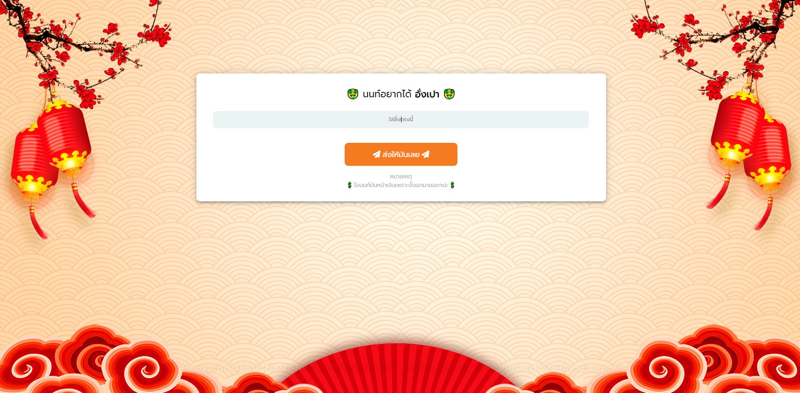

<h1><strong>🤑 | อยากได้ตัง | 🤑</strong></h1>

👻 **ดูตัวอย่างกด** => [PREVIEW](https://non-want-aungpao.cyclic.app/)

<h2>🛠 | วิธีใข้</h2>

1) ตั้งค่า **เบอร์** เเละ **port** ได้ที่ => `/config/config.js`
2) ติดตั้ง package ใข้คำสั่ง=> `yarn install`
3) เริ่มสามารถใช้ `yarn start` หรือ `yarn dev` สำหรับ **Nodemon**

<h2>📸 | ภาพตัวอย่าง</h2>

    

